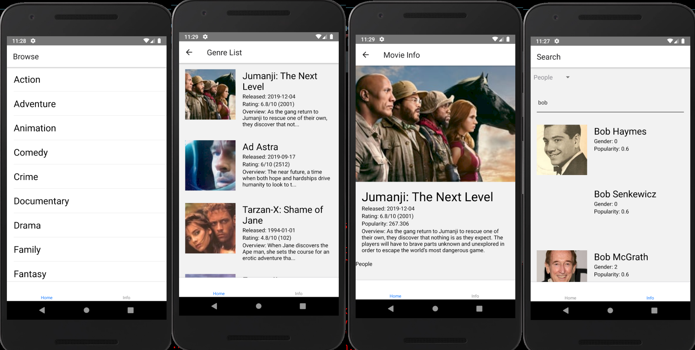

# movie-db-react-native

## About

movie-db-react-native is a mobile app that allows a user to get information on and
search for movies and actors by genre or name.



## Build Requirements

* Java SE or OpenJDK >= 8 and < 16
* Node 10 or newer
* [Android Studio](https://developer.android.com/studio/index.html) With the Android SDK specified in the [documentation](https://reactnative.dev/docs/0.60/enviroment-setup)
* [Watchman](https://facebook.github.io/watchman/docs/install/#buildinstall)

## How do I get React Native set up? ##

Follow the React Native guide for [Getting Started](https://reactnative.dev/docs/0.60/enviroment-setup)
Follow the CLI guide, not the Expo guide.

## How to run this project ##

First make a file `andoird/local.properties` and specify the Android SDK location in there.

On Linux this looks like `sdk.dir = /home/USERNAME/Android/Sdk`

Then:

```cd movie-db-react-native```

```npm i```

```npm start```

```npm run android``` (in a separate terminal)

## Contribution guidelines ##

This project is not being worked on. It was a learning tool for me.
Feel free to use it however you would like.

React native concepts and ideas used in this app include
* Continuous scrolling
* External API usage
* multiple pagination
* Various user input types